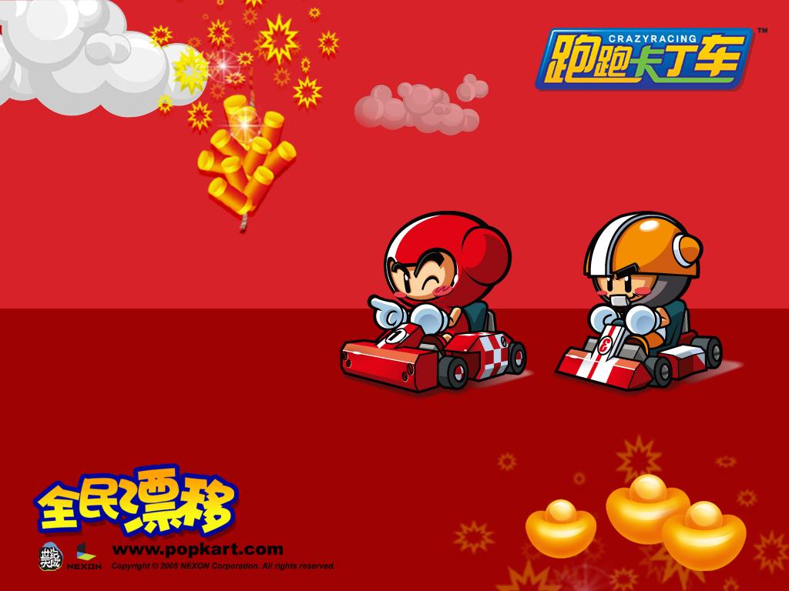

<p align="right">
  <a href="README.md">English</a> ·
  <a href="README.zh-CN.md">简体中文</a> ·
  <strong>한국어</strong>
</p>

<p align="center">
  
</p>

<h1 align="center">KartRider Tools</h1>

<p align="center">
  <a href="https://ko.wikipedia.org/wiki/%ED%81%AC%EB%A0%88%EC%9D%B4%EC%A7%80%EB%A0%88%EC%9D%B4%EC%8B%B1_%EC%B9%B4%ED%8A%B8%EB%9D%BC%EC%9D%B4%EB%8D%94">크레이지레이싱 카트라이더</a> 게임 에셋을 추출하고 프로덕션에 바로 사용 가능한 USD 씬으로 변환합니다.
</p>

<p align="center">
  <a href="#기능"><strong>기능</strong></a> ·
  <a href="#다운로드"><strong>다운로드</strong></a> ·
  <a href="#cinema-4d-플러그인"><strong>Cinema 4D 플러그인</strong></a> ·
  <a href="#면책-조항"><strong>면책 조항</strong></a>
</p>

<p align="center">
  
  
</p>

<p align="center">
  
</p>

---

크레이지레이싱 카트라이더의 게임 에셋을 스캔하고 변환합니다 — `.rho` 아카이브를 풀고, 자체 포맷인 `.1s` 바이너리를 파싱하여, 지오메트리 · 머티리얼 · 텍스처 · 애니메이션이 포함된 완전한 3D 씬을 생성합니다.

## 기능

- **에셋 스캔 및 변환** — `.rho` 아카이브와 `.1s` 모델 파일을 일괄 스캔하여 USD로 변환
- **맵** — 도로 지오메트리, 배경 오브젝트, 스카이 돔, 데코레이션, 오브젝트 애니메이션, UV/머티리얼 애니메이션, 투명도까지 포함한 전체 씬 익스포트
- **캐릭터** — 본 계층이 포함된 스킨 메시, 액션별 애니메이션 익스포트와 표정 텍스처 자동 매칭
- **카트** — 부품별 애니메이션을 지원하는 전체 모델 계층
- **애니메이션** — 모든 종류 지원: 오브젝트 트랜스폼 · UV · 머티리얼 · 스켈레탈
- **렌더 준비 완료** — 충돌체, 트리거 영역 등 비시각적 게임 데이터를 자동 정리

모든 에셋은 USD로 익스포트되므로 — 이후 어떤 DCC 툴이나 렌더링 파이프라인으로든 가져갈 수 있습니다.

---

## 다운로드

[**Releases**](https://github.com/nixliuxin/KartRider-Tools/releases) 페이지에서 최신 버전을 다운로드하세요.

릴리즈 패키지에는 다음이 포함됩니다:

| 파일 | 설명 |
|------|------|
| `KartRider-Tools.exe` | GUI 애플리케이션 — 더블클릭하여 실행 |
| `KartRiderTools for Cinema 4D/` | Cinema 4D 임포터 플러그인 |

설치가 필요하지 않습니다. 압축을 풀고 바로 실행하세요.

---

## Cinema 4D 플러그인

현재 **Cinema 4D 2026**만 지원합니다.

### 설치

1. `KartRiderTools for Cinema 4D` 폴더를 Cinema 4D `plugins` 디렉터리에 복사하세요:
   ```
   C:\Users\<사용자명>\AppData\Roaming\Maxon\Maxon Cinema 4D 2026_<hash>\plugins\
   ```
2. Cinema 4D를 재시작하세요
3. 플러그인이 **Extensions → KartRider Tools** 메뉴에 나타납니다

### 기능

- 표준 렌더러 및 Redshift 머티리얼 지원
- Diffuse(라이팅) / Flat(언릿) 셰이딩 모드 원클릭 전환
- UV 애니메이션 재구성
- 알파 채널 및 투명도 처리
- 자동 좌표계 변환 (Z-up → Y-up)
- 충돌체 및 비시각적 요소 자동 제외

---

## 면책 조항

> **참고**: 본 프로젝트의 모든 공식 문서는 영문판이 기준입니다. 본 한국어 번역본은 참고용으로만 제공되며, 번역과 영문 원본 사이에 모호함이 있을 경우 [README.md](README.md)의 영문판이 우선합니다.

본 프로젝트는 **교육, 연구 및 개인 비상업적 용도로만** 사용되어야 합니다. 본 소프트웨어는 명시적이든 묵시적이든 어떠한 보증도 없이 "있는 그대로(as is)" 제공되며, 여기에는 상품성, 특정 목적 적합성, 비침해성에 대한 보증이 포함되지만 이에 국한되지 않습니다.

**크레이지레이싱 카트라이더 / CrazyRacing KartRider**, 모든 게임 에셋, 아트워크 및 관련 상표는 **NEXON Korea Corporation**, **Tiancity** 및/또는 각 라이선스 보유자 및 계열사의 자산입니다. 본 프로젝트는 이들 회사 어느 곳과도 **제휴, 보증, 후원 관계가 없습니다**.

본 도구는 저작권으로 보호되는 게임 콘텐츠를 **포함하거나, 번들로 묶거나, 배포하지 않습니다**. 단지 상호운용성을 목적으로 파일 포맷을 읽고 변환하는 수단을 제공할 뿐입니다. 사용자는 자신의 사용이 모든 관련 법률, 규정 및 해당 게임의 서비스 약관을 준수하는지 확인할 책임이 있습니다.

어떠한 경우에도 저작자 또는 기여자는 본 소프트웨어 또는 그 사용으로 인해 발생하는 모든 청구, 손해 또는 기타 책임에 대해, 계약, 불법행위 또는 기타 법리에 근거하든, 책임을 지지 않습니다.

만약 권리 보유자가 본 프로젝트가 자신의 지적 재산권을 침해한다고 판단할 경우, issue를 통해 알려주시면 신속히 조치하겠습니다.

## 감사의 말

- [Kartrider-File-Reader](https://github.com/xpoi5010/Kartrider-File-Reader) — xpoi5010 작 — `.rho` 아카이브 압축 해제
- [kartrider_model_1s_to_obj](https://github.com/VT-Tuzki/kartrider_model_1s_to_obj) — VT-Tuzki 작 — `.1s` 모델 파싱에 관한 초기 작업으로, 바이너리 포맷 분석에 영감을 주었습니다
- LuoHui666 — 맵 씬 추출의 핵심 과제 해결에 도움이 된 논의를 함께해 주셨습니다

## 라이선스

Copyright © 2026 nixliuxin. All rights reserved.

본 소프트웨어는 **개인 및 비상업적 용도에 한해** 무료로 제공됩니다. 재배포, 리버스 엔지니어링, 디컴파일은 금지됩니다. 본 소프트웨어는 어떠한 종류의 보증도 없이 "있는 그대로" 제공됩니다.

---

<p align="center">
  <sub>월페이퍼 아트워크 © 2005 NEXON Corporation</sub>
</p>
